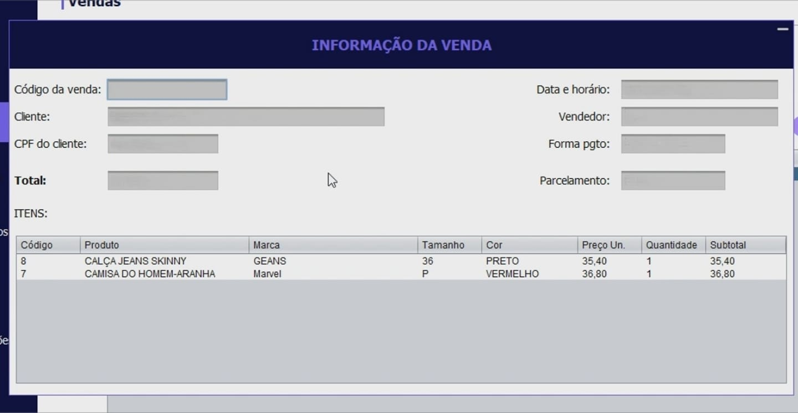
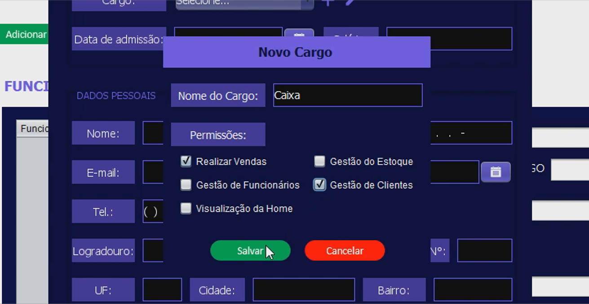

# Sistema de Gestão para Lojas de Roupas
Este sistema foi um projeto desenvolvido para o projeto semestral da Universidade Nove de Julho.

O projeto consistia em criar um sistema comercial utilizando Java.

Grupo:
- [Daniel Tomazi de Oliveira](https://github.com/DanielTomazi);
- [Cynthia Rodrigues Di Poli Ribamar](https://github.com/cynthiaribamar);
- [Fernando Gonçalves Andrade Bilha](httpsgit://github.com/liinqy);
- [Paulo Henrique Silva Guimarães](https://github.com/PaulofrontHenrique);

**Para utilizar o sistema é necessário fazer um login, utilizando 'admin' como usuário e senha.**

## Algumas telas do sistema

### Tela inicial (Home)

### Tela de login

### Tela de produtos

### Tela de vendas

### Tela de informações de vendas (a partir do histórico)

### Tela de cadastro de novos produtos

### Tela de cadastro de funcionários

Um login é gerado com o email e o CPF, e o funcionário terá restrições no sistema de acordo com o cargo.

### Tela de cadastro de cargos (onde é possível selecionar as permissões no sistema)

